# ResQNet — Emergency Communication Network Simulation

> **Reliable Routing. Resilient Communication. Real-Time Simulation.**

**Domain**: Computer Networks and Internet Protocols (CNIP)  
**Project Title**: ResQNet — Emergency Communication Network Simulation  
**Project Type**: Full-Stack Network Simulation & Emulation Platform  
**Languages/Frameworks**: Python 3 (Flask, PyMongo), React 19, Vite, Tailwind CSS, React Flow (`@xyflow/react`), Recharts  
**Design System**: Minimal Monochrome Dashboard with Deep Forest Green (`#064E3B`) and Champagne Gold (`#F8E7C9`) Accents  
**Database**: MongoDB (Collections: `networks`, `simulations`, `packet_logs`, `routing_results`, `performance_results`, `network_events`)

---

## 1. Strict Minimal Monochrome Theme

The application strictly implements an elegant, high-readability monochromatic palette:

* **Pure White**: `#FFFFFF` (Card surfaces, primary sidebar background, canvas)
* **Off-White**: `#F8F8F6` (App background, table headers, legend panels)
* **Soft Off-White**: `#F2F2EF` (Active navigation states, input backgrounds, tags)
* **Light Neutral Border**: `#E8E8E5` (Structural borders, dividers, subtle card boundaries)
* **Primary Text**: `#252525` (Headings, primary metrics, active nodes, primary buttons)
* **Secondary Text**: `#737373` (Captions, timestamps, secondary metrics, inactive states)

*Colors like blue, red, green, yellow, orange, and purple are strictly excluded. Network states are expressed cleanly through text tags (e.g. `[ACTIVE]`, `[FAILED]`, `[CONGESTED]`, `[ACK]`), border styles, and line weights.*

---

## 2. System Architecture

```mermaid
graph TD
    subgraph Frontend ["React 19 Frontend (Port 5173) - Monochrome"]
        UI_Dash[Dashboard & KPI Metrics]
        UI_Topo[React Flow Topology Editor]
        UI_Route[Routing: Dijkstra & Distance Vector]
        UI_Fail[Dynamic Link Failure Simulation]
        UI_Tx[Packet Lifecycle Simulator]
        UI_CRC[CRC Modulo-2 Bit Visualizer]
        UI_ARQ[Go-Back-N Sliding Window]
        UI_Cong[Leaky Bucket Traffic Shaper]
        UI_Analytics[Recharts Analytics & CSV Export]
    end

    subgraph Backend ["Backend (Python Flask REST API - Port 5000)"]
        API[Flask REST API Layer]
        DijkstraEngine[Dijkstra Min-Heap Engine]
        DVEngine[Distance Vector Engine]
        FailureMgr[Link Failure Manager]
        CRCEngine[CRC Polynomial Engine]
        ARQEngine[Go-Back-N ARQ Engine]
        LeakyEngine[Leaky Bucket Engine]
        SimEngine[Discrete-Event Network Simulator]
        PerfEngine[Performance Analyzer]
    end

    subgraph Database ["Database Layer (MongoDB Server)"]
        ColNet[(networks)]
        ColSim[(simulations)]
        ColLogs[(packet_logs)]
        ColRoute[(routing_results)]
        ColPerf[(performance_results)]
        ColEvt[(network_events)]
    end

    UI_Dash -->|REST API / Axios| API
    UI_Topo -->|REST API / Axios| API
    UI_Route -->|REST API / Axios| API
    UI_Fail -->|REST API / Axios| API
    UI_Tx -->|REST API / Axios| API
    UI_CRC -->|REST API / Axios| API
    UI_ARQ -->|REST API / Axios| API
    UI_Cong -->|REST API / Axios| API
    UI_Analytics -->|REST API / Axios| API

    API --> DijkstraEngine
    API --> DVEngine
    API --> FailureMgr
    API --> CRCEngine
    API --> ARQEngine
    API --> LeakyEngine
    API --> SimEngine
    API --> PerfEngine

    API --> ColNet
    API --> ColSim
    API --> ColLogs
    API --> ColRoute
    API --> ColPerf
    API --> ColEvt
```



---

## 3. Network Topology Details

Default 7-node emergency communication graph:

| Node ID | Label | Role | Coordinates (x, y) |
|---|---|---|---|
| **N0** | Emergency Control Center | Control Center | (100, 200) |
| **N1** | Police Station | First Responder | (300, 80) |
| **N2** | Fire Services | First Responder | (300, 320) |
| **N3** | Ambulance Unit | Medical Dispatch | (520, 140) |
| **N4** | Field Response Team | Search & Rescue | (520, 20) |
| **N5** | Emergency Shelter | Civilian Evacuation | (750, 200) |
| **N6** | Backup Control Center | Redundant Command | (520, 360) |

Links Configuration:

| Link | Metric Cost | Bandwidth (Mbps) | Propagation Delay (ms) | Packet Loss Rate | Status |
|---|---|---|---|---|---|
| N0 ↔ N1 | 2.0 | 100 Mbps | 10 ms | 2% | Active (Solid Line) |
| N0 ↔ N2 | 4.0 | 100 Mbps | 15 ms | 2% | Active (Solid Line) |
| N1 ↔ N3 | 3.0 | 50 Mbps | 12 ms | 3% | Active (Solid Line) |
| N2 ↔ N3 | 1.0 | 50 Mbps | 5 ms | 1% | Active (Solid Line) |
| N3 ↔ N5 | 2.0 | 100 Mbps | 8 ms | 2% | Active (Solid Line) |
| N1 ↔ N4 | 5.0 | 20 Mbps | 25 ms | 5% | Active (Solid Line) |
| N4 ↔ N5 | 2.0 | 20 Mbps | 20 ms | 4% | Active (Solid Line) |
| N2 ↔ N6 | 3.0 | 100 Mbps | 10 ms | 2% | Active (Solid Line) |
| N6 ↔ N5 | 3.0 | 100 Mbps | 15 ms | 3% | Active (Solid Line) |
| N0 ↔ N6 | 6.0 | 50 Mbps | 30 ms | 5% | Active (Solid Line) |

---

## 4. Automated Testing Suite

The suite verifies all 14 required networking concepts:

```bash
python -m pytest backend/tests/ -v
```

```text
backend/tests/test_api_endpoints.py::test_api_health PASSED              [  5%]
backend/tests/test_api_endpoints.py::test_api_topology_and_reset PASSED  [ 10%]
backend/tests/test_api_endpoints.py::test_api_dijkstra PASSED            [ 15%]
backend/tests/test_api_endpoints.py::test_api_distance_vector PASSED     [ 20%]
backend/tests/test_api_endpoints.py::test_api_crc_encode_verify PASSED   [ 25%]
backend/tests/test_api_endpoints.py::test_api_simulation_start_and_analytics PASSED [ 30%]
backend/tests/test_network_algorithms.py::test_1_dijkstra_shortest_path PASSED [ 35%]
backend/tests/test_network_algorithms.py::test_2_dijkstra_unreachable_destination PASSED [ 40%]
backend/tests/test_network_algorithms.py::test_3_distance_vector_convergence PASSED [ 45%]
backend/tests/test_network_algorithms.py::test_4_routing_table_updates_after_link_failure PASSED [ 50%]
backend/tests/test_network_algorithms.py::test_5_crc_valid_frame PASSED  [ 55%]
backend/tests/test_network_algorithms.py::test_6_crc_corrupted_frame PASSED [ 60%]
backend/tests/test_network_algorithms.py::test_7_go_back_n_lost_frame_retransmission PASSED [ 65%]
backend/tests/test_network_algorithms.py::test_8_go_back_n_corrupted_frame_recovery PASSED [ 70%]
backend/tests/test_network_algorithms.py::test_9_leaky_bucket_queue_overflow PASSED [ 75%]
backend/tests/test_network_algorithms.py::test_10_packet_loss_calculation PASSED [ 80%]
backend/tests/test_network_algorithms.py::test_11_throughput_calculation PASSED [ 85%]
backend/tests/test_network_algorithms.py::test_12_average_delay_calculation PASSED [ 90%]
backend/tests/test_network_algorithms.py::test_13_no_route_packet_handling PASSED [ 95%]
backend/tests/test_network_algorithms.py::test_14_reproducibility_using_random_seed PASSED [100%]

============================= 20 passed in 0.45s ==============================
```

---

## 5. Running the Application

### 1. Backend Server
```bash
python backend/app.py
```
*Runs on `http://localhost:5000` (API Health: `http://localhost:5000/api/health`)*

### 2. Frontend Web App
```bash
cd frontend
npm run dev
```
*Runs on `http://localhost:5173/`*
